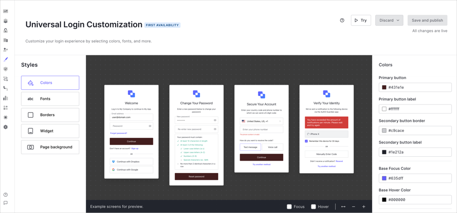

# Terraform Auth0 Branding Theme Project

This terraform script allows you to style the Okta CIC (Auth0) widget based on the following [documentation](https://auth0.com/docs/customize/login-pages/universal-login/customize-themes)



## Disclaimer :warning:
---
This project serves as a Sample Demo, which can be tweaked or completely re-purpose.

## Assumptions
This project assumes you have the following basic knowledge of the CIC Universal Login customization process and Terraform.

## Prerequisties
* Terraform v1.5.4+
* Okta CIC Tenant (Auth0) -- If you do not already have an Auth0 Tenant, you can create one [here](https://auth0.com/signup?place=header&type=button&text=sign%20up).

### Demo Setup Steps
1. Register Machine-to-Machine Applications [How-to](https://auth0.com/docs/get-started/auth0-overview/create-applications/machine-to-machine-apps)
2. Enable Management API access to for the application created above with the following scopes. [How-to](https://auth0.com/docs/get-started/apis/add-api-permissions)

```json
//Required Auth0 Management API scopes
update:branding
read:branding
delete:branding
```

### Installation and Configuration
1. Clone the repo
```bat
git clone https://github.com/intheorysecurity/terraform-auth0-branding-theme
```

2. Copy the contents of the terraform.tfvars.example file.
```powershell
#Windows
copy terraform.tfvars.example terraform.tfvars

#Linux
cp terraform.tfvars.example terraform.tfvars
```

3. Update the variables in the terraform.tfvars file from the info gathered during the [Demo Setup Steps](#demo-setup-steps)
```powershell
//Auth0 Environment Config
auth0_domain = "example.us.auth0.com"
auth0_client_id = "applicationClientID"
auth0_client_secret = "applicationClientSecret"
//Optional
# auth0_debug = false
```

4. Within the terraform.tfvars, add any branding configuration attributes you would want to leverage. For full list of attribute reference the variables.tf file and the offical [schema](https://registry.terraform.io/providers/auth0/auth0/latest/docs/resources/branding_theme#schema).

Sample Configuration: 

```powershell
//Auth0 Branding Config
primary_button = "#635dff"
background_image_url = "<Background image url>"
logo_url = "<Logo URL>"
# logo_height = 52.0
# font_url = "<Font URL>"
```

4. Save the terraform.tfvars file.
5. Run `terraform init`
6. Run `terraform plan`
7. Run `terraform apply --auto-approve`
8. After the terraform script completes, your Auth0 login widget will be update with the given branding configuration.

## Contributing
---
Pull requests are welcome. For major changes, please open an issue first to discuss what you would like to change.

Please make sure to update tests as appropriate.

## License
---
[MIT](https://choosealicense.com/licenses/mit/)